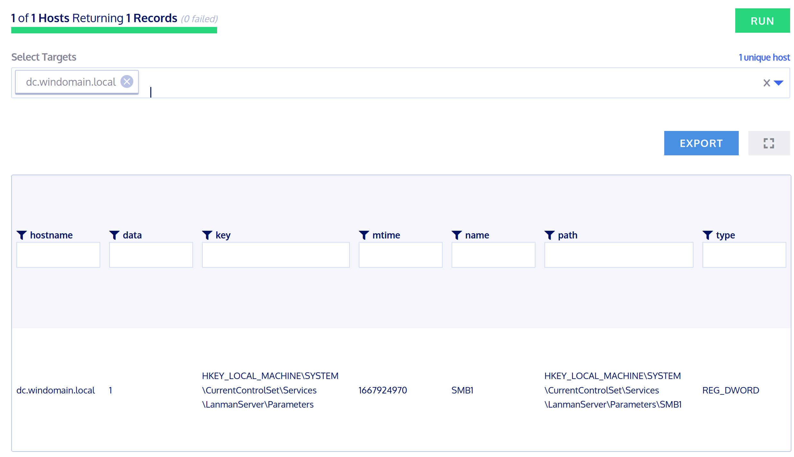
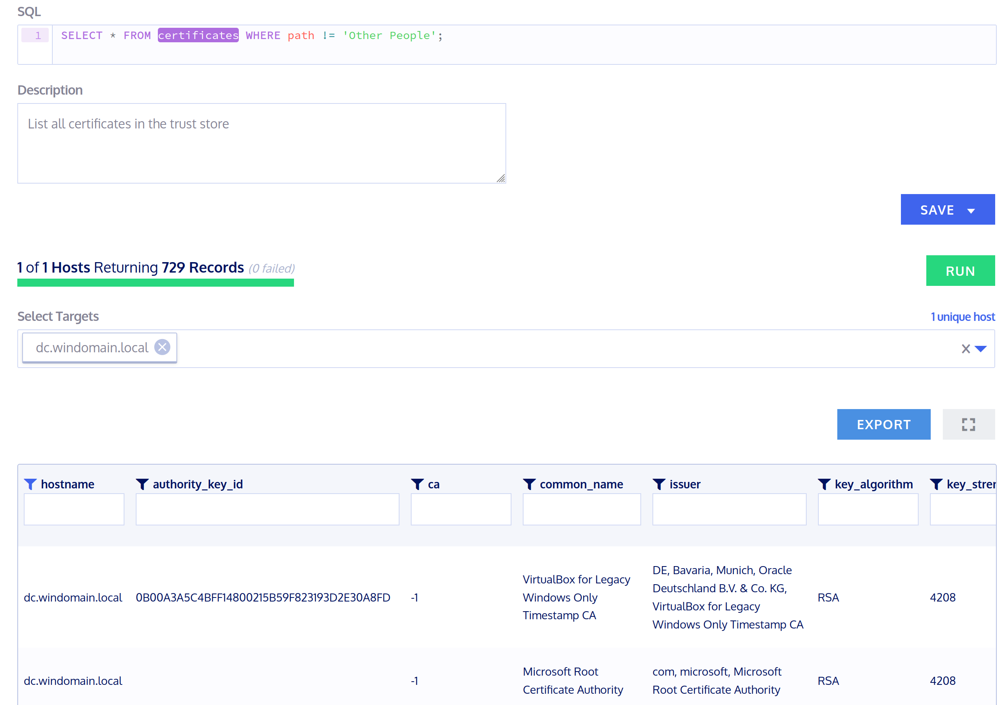

# Fleet

## Recherche

Kolide Fleet ist in der Version 3.2.0 (8. Oktober 2022), aber wurde im November 2020 komplett eingestellt. Mit Fleet konnte man einfach (mit teils vordefinierten Queries) Abfragen auf Clients oder Server machen, auf welchen osQuery installiert war. Da Fleet aber keine Datenbank hat um alle Werte zu speichern, wurde es eher im Serverumfeld gebraucht. Da Clients oft Offline sind. Man könnte wirklich alles abfragen (z.B Browserverlauf), wobei man dann aber auf den Datenschutz achten muss. Es eignet sich aber auch, um Security Relevante Dinge abzufragen.

## Testing 1

Alte Protkolle wie SMBv1 sollten auf Systemen nicht mehr aktiv sein. Ich war so unartig und habe es auf dem DC wieder aktiviert. Durch einen Reg-Key fragt osQuery diesen Wert ab.

```sql
SELECT * FROM registry WHERE path='HKEY_LOCAL_MACHINE\SYSTEM\CurrentControlSet\Services\LanmanServer\Parameters\SMB1';
```



Der Wert ist 1 also ist SMBv1 aktiviert.

## Testing 2

Damit gewisse Dienste auf einem Windowsgerät sauber funktionieren und diese sicher unterwegs sind, braucht es Zertifikate und Zertifizierungsstellen, welchen vertraut wird. Mit einer Query könnte man im Unternhemn schauen, ob auf allen Geräten, z.B die interne CA installiert ist. Es ist ersichtlich, ob ein Zertifikat auf den User oder die lokale Maschine installiert wurde, welche Algorithmen es verwendet, wie lange es gültig ist etc.

