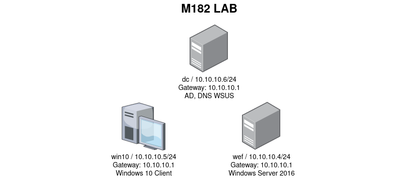

# Infrastruktur

## Mini Netzwerk-Diagramm



Da bei mir auf Ubuntu der Host-Only-Adapter nicht funktionierte, habe ich ein neues NAT-Netzwerk gemacht, damit alle VMs miteinander verknüpft sind.
Dazu musste noch der DNS auf allen Geräten auf den DC angepasst werden. Den Windows Update Dienst habe ich bei allen Server auf automatisch gesetzt, damit man ihn nicht immer manuell starten muss.

## Login

Auf allen Servern wird man automatisch mit vagrant eingeloggt. Beim DC mit dem AD-User vagrant und bei der win10 und wef mit dem lokalen User vagrant. Optimal wäre für jeden Server einen einzelnen AD-User zu machen und nicht automatisch einzuloggen.

## Installierte Dienste und Zugriff

### wef

Hier ist nicht viel installiert ausser das Microsoft Advanced Threat Analytics Center. Per ```wef.windomain.local:80/``` oder 443 kann man auf die Konsole zugreifen.

### win10

Die Classic-Shell ist installiert, um ein anderes Windows Start-Menu / Suche zu haben

### dc

Auf dem DC sind AD-Services (File via Port 445, LDAP/S und Global Catalog via 389/636/3268/3269), DNS (53) und WSUS via Port 8530 und verschlüsselt via 8531 (dazu IIS, Port 80) installiert. Hinzu kommt der Microsoft Advanced Thread Analytics Gateway. Auf die hinterlegte exe in der Firewall darf jeder über jeden Port darauf zugreifen.


Auf allen ist Velociraptor (Zugriff via Port 5985) installiert, was wahrscheinlich für den ELK-Stack benötigt wird. Installiert sind ebenfalls Standard-Tools wie WinRAR, Notepad++, Google Chrome etc. Auf alle 3 Windows Geräte kann man per RDP (Port 3389) zugreifen.

## ELK-VM

## Vagrant File


