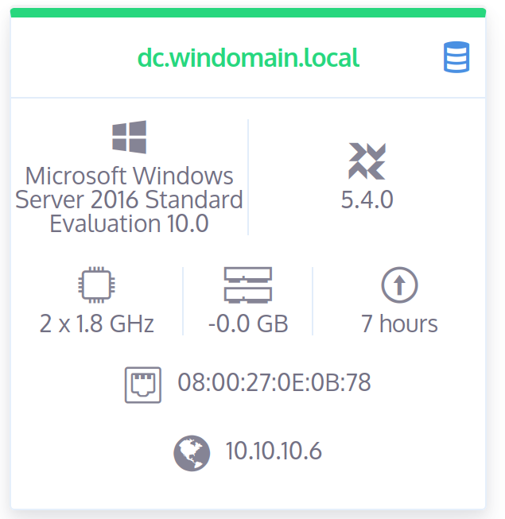
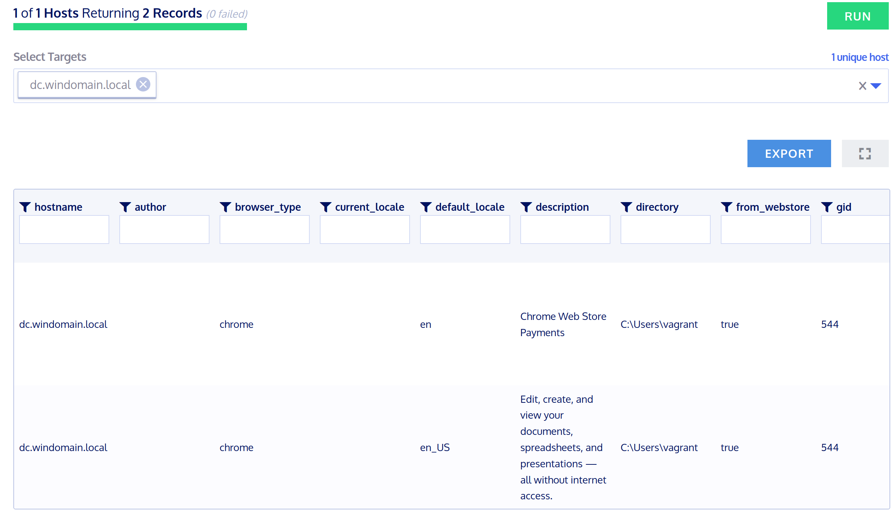

# OSQuery

## Client Registrierung

Von [Github](https://github.com/kolide/launcher/releases/download/v0.12.1/windows-binaries.zip) das ZIP herunterladen und in das Verzeichnis gehen wo die ```launcher.exe``` liegt.

Folgender Befehl ausführen, um den DC an der Kolide Software bekannt zu machen:

```cmd
.\launcher.exe --enroll_secret=enrollmentsecret --hostname=logger:8412 --root_directory="C:\\Program Files\\osquery" --insecure
```

CMD schliessen und den Dienst "osqueryId" starten.

## Recherche

OSquery kann mit einem installierten Agent diverse Information vom Betriebsystem auslesen. (Hostname, IP, MAC-Adresse, CPU, RAM, Registry-Keys etc.) Diese werden in einer Datenbank gespeichert und können einfach mit SQL abgefragt werden.
OSQuery ist aktuell in der Version 5.6.0 (Stand 10. Oktober 2022).  
Ein Use-Case ist z.B Registry-Keys zu überwachen, ob ein Server die Updates vom richtigen Server bezieht und diese installiert wurden. Falls wiedermal ein Exploit einer Software bekannt ist, kann die installierte Software und deren Version ausgelesen werden.

## Konfiguration / Testing

Die Konfiguration in Windows liegt unter ```C:\Program Files\osquery\osquery.conf``` und in Linux unter ```/etc/osquery/osquery.conf```. Das Configfile ist im JSON-Format und hat folgende Hauptelemente:

* ```"options":``` Konfigurationen zum osquery-daemon selbst.
* ```"schedule":``` Beim DC wird von ```system_info``` stündlich ```hostname```, ```cpu_brand``` und ```physical_memory``` ausgelesen.
* ```"decorators":``` Normale Abfragen, welche die Infos zu jeder Query anhängt.
* ```"packs":```: Ermöglicht mit eigenen Configfiles weitere Analysefunktionen zu implementieren.

* [Weitere Konfigurationen](https://osquery.readthedocs.io/en/stable/deployment/configuration/)

Der DC erscheint auf Kolide:



Nun kann ich vom DC z.B die Chrome-Extensions auslesen, dafür gibt es vorgefertigte Queries:


