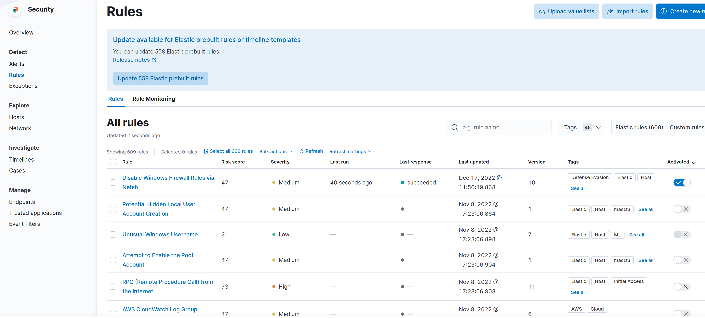
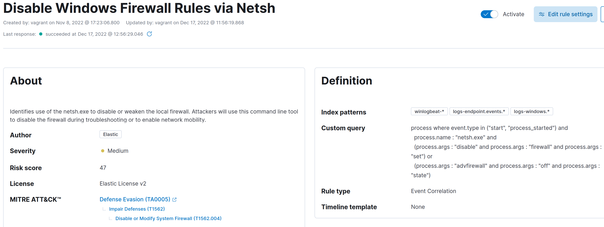
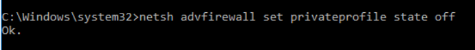
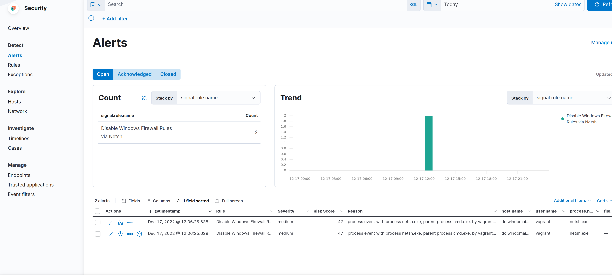

# ELK Security Dashboards

## Aufbau

Security Rules, fragen Daten anhand von Attributen (id, name, state etc.) aus einem Index aus.



Es gibt verschiende vordefinierte Rules. Eine wäre z.B die ```Disable Windows Firewall Rules via Netsh``` und ist folgendermassen aufgebaut.



Die Query fragt die Daten aus dem Index ```Winlogbeat-*``` aus. Wenn der event.type ```start``` ist und der Prozessname ```netsh.exe``` ist, sowie die Prozessargumente ```disable```, ```firewall``` und ```set``` enthalten oder ```advfirewall```, ```off``` und, ```state```, dann wird ein Alarm generiert. Ich habe zum testen folgenden Befehl auf dem DC ausgeführt, welcher die Private Firewall deaktiviert.



Nun wird ein Alarm generiert, welcher die Zeit, User, Hostname, Prozess, Ausmass (Low, Middle, High) etc. beinhaltet.



