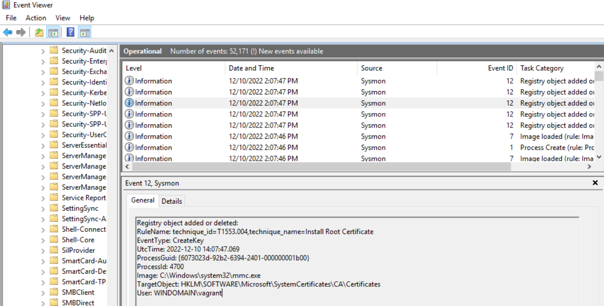

# Sysmon

## Recherche

Sysmon heisst System Monitor und die neuste Version ist aktuell v14.12 (10.11.2022)
Mithilfe von Sysmon kann das ganze System protokolliert werden. (Dienste, Registry-Einträge, Zugriffe etc.) Es hilft bei Fehlersuchen oder beim aufspüren von Malware-Aktivitäten. Es kann z.B nach bestimmten Events gesucht werden und mit Conditions verglichen werden. (is, contains, less than etc.)
Weitere hilfreiche Informationen auf [Microsoft](https://learn.microsoft.com/en-us/sysinternals/downloads/sysmon)

## Installation

### Manuell

1. [Download](https://download.sysinternals.com/files/Sysmon.zip)
2. Ein Konfigurationsfile erstellen / herunterladen
3. sysmon64.exe und config.xml nach C:\Windows verschieben
4. C:\Windows\sysmon64.exe –accepteula –i c:\windows\config.xml

### Automatisiert

Auf unseren Systemen ist Sysmon mittels Vagrantfile direkt mitinstalliert worden.
Es gäbe auch die Möglichkkeit dies über ein Softwareverteilungssystem wie SCCM zu machen oder auch per GPO.

### Konfiguration

Auf z.B dem DC ist Sysmon (inkl. Configfile) in ```C:\ProgramData\Sysmon``` installiert.

### Konfigurationsfile

Das Konfigurationsfile ist in der Schemaversion 4.60.  
3 Hauptoptionen wurden am Anfang definiert:

```sysmon
<HashAlgorithms>*</HashAlgorithms> <!-- Sämtliche Hashalgorithmen werden verwendet -->
<CheckRevocation>False</CheckRevocation> <!-- Signaturen werden nich überprüft -->
<DnsLookup>False</DnsLookup> <!-- IP Adressen werden nicht aufgelöst -->
```

Innerhalb vom ```<Sysmon>```-Tag wird der Tag ```<EventFiltering>``` definiert. Darin können ```<RuleGroups>```-Tags erstellt werden in der Sachen überwacht werden können. (ProcessCreate, ProcessTerminate, NetworkConnect etc.) Mit ```onmatch=``` kann angegeben werden, ob die Filterbedingung bei Zutreffen inkludiert oder exkludiert wird. Z.B bei NetworkConnect macht es sinn Cloud-Dienste wie OneDrive, Dropbox etc. zu exkludieren.

Eventname           | Inkludiert           | Exkludiert
--------------------|----------------------|------------------
ProcessCreate       | sethc.exe, utilman.exe, wsl.exe, explorer.exe | Adobe Tools, chrome.exe
FileCreateTime      | Tempverzeichnisse und C:\Users | chrome.exe, slack.exe, Teams.exe
NetworkConnect      | VNC-Services, reg.exe, powershell.exe |
Dropbox, Antiviren Sachen
ProcessTerminate    | Tempverzeichnisse und C:\Users | -
DriverLoad          | - | Valid Intel und Microsoft
ImageLoad           | Diverse Pfade und DLLs (Libraries) | OneDrive exe's und DLL's
CreateRemoteThread  | C:\, \\ | svchost.exe, winlogon.exe, services.exe
ProcessAccess       | Systemprozesse wie services.exe, wininit.exe | Adobe, Citrix, ELK, Autodesk
FileCreate          | bat und cmd | Ivanti Workspace Control, Update-Utilities
RegistryEvent       | Div. Reg-Keys | Cisco AnyConnect, McAfee, Windows Defender ATP
FileCreateStreamHash| .exe, .hta, .bat, .cmd, .lnk | -
PipeEvent           | WindowsShares, powershell.exe | Adobe Zeugs, Citrix, Google Chrome, SQL, TrendMicro
WMIEvent            | WMI Created | -
DNSQuery            | - | Trusted-Domains
FileDelete          | cleanmgr.exe, Office-Dokumente- und Skriptendungen | svchost.exe, .tmp
ClipboardChange     | Wegen privacy und möglichem Abfluss von Daten | -
ProcessTampering    | - | Edge, Firefox, VS-Code, Git
FileDeleteDetected  | .com, .bat, .reg, .exe, .7z, .vbs ... | Chrome reporter und chrome.exe

Es wurden nur ein paar Beispiel Services / .exe genannt. Es gibt noch sehr viele weitere, welche im Configfile enthalten sind.

### Nutzung

Sysmon Logs zu finden unter: **Application and Services Logs --> Microsoft --> Windows --> Sysmon --> Operational**

Beispiel: Hier wird Eine Registry Veränderung geloggt, da es durch die ```mmc.exe``` ausgeführt wurde.


