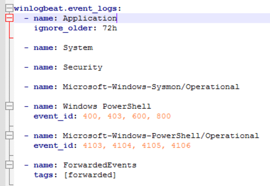

# Winlogbeat

## Recherche

Winlogbeat ist von [Elastic](https://www.elastic.co/beats/winlogbeat). Es dient dazu die Windows Event Logs and ELK zu übergeben. Wenn die Netzwerkverbindung ausfällt kann alles in einem Spooler gespeichert und zu einem späteren Zeitpunkt an ELK gesendet werden. Die aktuelle Version davon ist aktuell 8.5.3 (6. Dezember 2022)

## Installation Winlogbeat

Download [hier](https://www.elastic.co/downloads/beats/winlogbeat). Extrahieren nach ```C:\Program Files``` und Ordner in ```Winlogbeat``` unbennenen. In diesem Verzeichnis das PS-Skript ```install-service-winlogbeat.ps1``` als Admin ausführen.

```winlogbeat.yml``` in diesem Verzeichnis folgendermassen bearbeiten:


Der hier hinterlegte User muss berechtigt sein Winlogbeat einzurichten.
**Nachtrag:** ```allow_older_versions: true```, muss noch hinzugefügt werden, ansonsten kann Kibana keine Verbindung zur unseren veralteten Elasticsearch-Instanz herstellen. (Error in Logfile erschienen)


Hostname der Kibana-Instanz, sowie User angeben.

Die Winlogbeat Eventlog Einstellungen können auf Standard belassen werden. Standardmässig werden Application, Security System, Sysmon und noch ein paar weitere Logs aktiviert. Die Application Logs, welche älter als 72 Stunden sind, werden ignoriert.



Testen mit: ```.\winlogbeat.exe test config -c .\winlogbeat.yml -e```

Sollte ein paar Logs ausgeben und am Schluss ```Config OK``` ausgeben.

## Setup Assets

Winlogbeat wird mit vordefinierten Assets zum Parsen, Indizieren und Visualisieren der Daten geliefert.

```.\winlogbeat.exe setup -e```

Sollte etwa so aussehen und am Schluss ```Loaded Ingest pipelines``` ausgeben


## Starten des Services

```powershell
Start-Service winlogbeat
```

## Logdaten anzeigen

Sysmon Logs sind hier drin auch zu finden.


