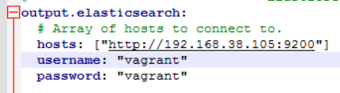

# Winlogbeat

## Recherche

Winlogbeat ist von [Elastic](https://www.elastic.co/beats/winlogbeat). Es dient dazu die Windows Event Logs and ELK zu übergeben. Wenn die Netzwerkverbindung ausfällt kann alles in einem Spooler gespeichert und zu einem späteren Zeitpunkt an ELK gesendet werden. Die aktuelle Version davon ist aktuell 8.5.3 (6. Dezember 2022)

## Installation Winlogbeat

Download [hier](https://www.elastic.co/downloads/beats/winlogbeat). Extrahieren nach ```C:\Program Files``` und Ordner in ```Winlogbeat``` unbennenen. In diesem Verzeichnis das PS-Skript ```install-service-winlogbeat.ps1``` als Admin ausführen.

```winlogbeat.yml``` in diesem Verzeichnis folgendermassen bearbeiten:


Der hier hinterlegte User muss berechtigt sein Winlogbeat einzurichten.


Die Winlogbeat Eventlog Einstellungen können auf Standard belassen werden. Standardmässig werden Application, Security und System Logs aktiviert. Die Application Logs, welche älter als 72 Stunden sind, werden ignoriert.


Testen mit: ```.\winlogbeat.exe test config -c .\winlogbeat.yml -e```

Sollte ```Config OK``` ausgeben.

## Setup Assets

.\winlogbeat.exe setup -e

