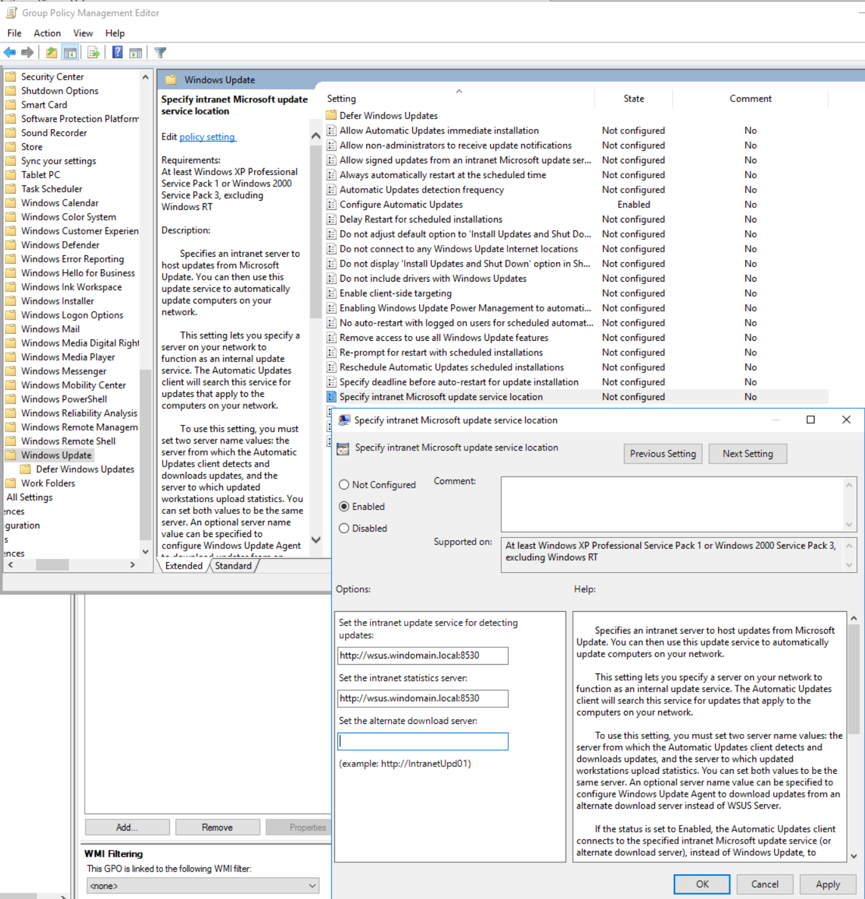
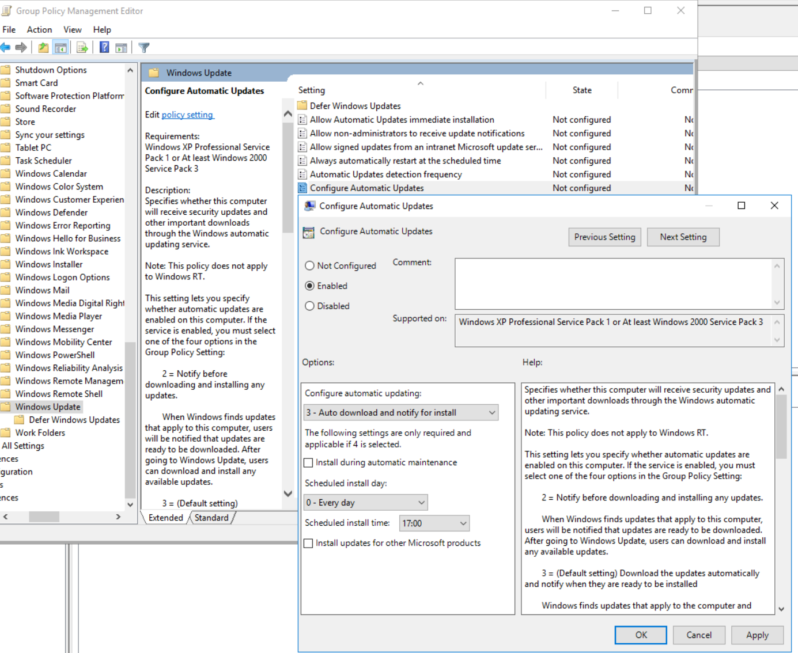
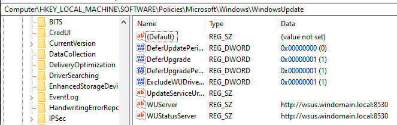
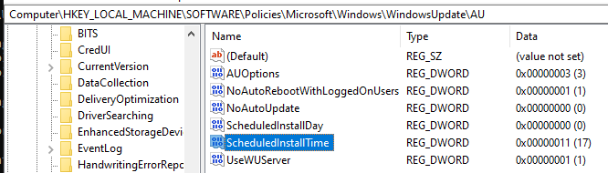
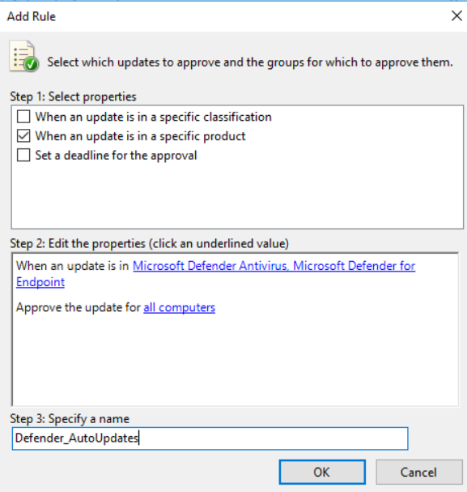
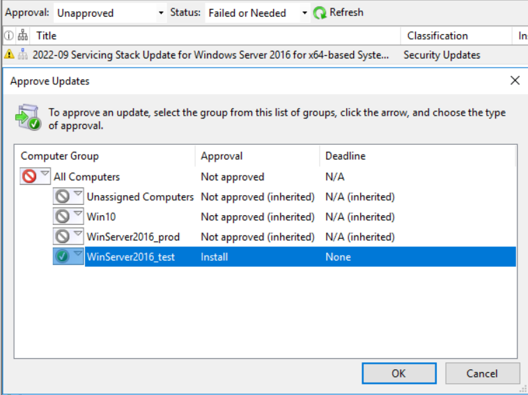

# WSUS

## Recherche

WSUS wird verwendet, um für Windows spezifische Update freizugeben. Dazu gehören Updates für Microsoft Produkte wie Defender oder .NET Framework, die montalichen Kumulativen Updates, Feature Updates oder auch Treiber Updates.

WSUS Alternativen wären SCCM, Ivanti Securiry Controls oder Matrix42 Patch Management. Auch viele andere Softwareverteilungssysteme bieten das verteilen von Updates an.

Wenn man die PowerShell als Admin auf dem WSUS-Server ausführt, kann man diverse PowerShell Befehle nutzen, um den WSUS zu managen. Um eine Synchronisation zu steuern braucht man nur folgendes auszuführen:

```powershell
(Get-WsusServer).GetSubscription().StartSynchronization()
```

Alle Computer auslesen:

```powershell
Get-WsusComputer
```

Viele weitere cmdlets zum Freigeben oder Ablehnen von Updates unter [business.com](https://www.business.com/articles/powershell-windows-software-update-services/)

Für Linux gäbe es die Möglichkeit einen lokalen Mirror zu hosten, welcher die Updates von einem öffentlichen bezieht. Auf den Clients trägt man dann diesen lokalen Mirror ein.

## Installation

Die Installation für einen WSUS kann man einfach in einem Server-Manager vornehmen. Dazu wählt man den Dienst ```Windows Server Update Services``` aus.


Der IIS-Webserver wird automatisch ausgewählt, da Updates mithilfe des IIS verteilt werden.


Die Features so belassen, wie sie sind.


WID-Connectivity (Windows Internal Database Verbindung) ist die Datenbank des WSUS. Anstelle von WID könnte auch SQL-Server ausgewählt werden.


Hier kann eine Platte ausgewählt werden, wo die Updates gespeichert werden. In meinem Fall habe ich eine Platte mit 30GB angelegt.  
**Nachtrag:** Nicht wie im Bild ```E:``` angeben sondern unbedingt ```E:\```, da sonst später der Download Pfad für Updates nicht stimmt. Laut Log heisst er dann ```E:WsusContent``` und kann aufgrund des fehlenden ```\``` nicht gefunden werden.


Die Rollen von IIS so belassen, wie sie sind.

## Konfiguration

### Initiale Konfiguration


1. Clients sind im selben Netz wir der WSUS
2. Server darf zu Microsoft verbinden
3. Proxy-Server haben wir nicht


Haken deaktivieren und Next


Auswählen, dass von Microsoft synchronisiert wird


Wir verwenden keinen Proxy, so muss auch beim WSUS nichts konfiguriert werden. Falls ein Proxy im Unternehmen verwendet wird, muss dies konfiguriert werden. Weitere Infos bei [Microsoft](https://learn.microsoft.com/fr-fr/security-updates/WindowsUpdateServices/18127272)


Die Sprache auf **Nur English** belassen.


Folgende, für meine Infrastruktur notwendige Produkte, habe ich ausgewählt:

* Microsoft Advanced Threat Analytics
* Microsoft Defender Antivirus
* Microsoft Defender for Endpoint
* Microsoft Endpoint
* Windows 10
* Windows 10 and later drivers
* Windows 10, version 1903 and later
* Windows 10, version 1903 and later, Upgrade & Servicing Drivers
* Windows Server 2016 and Later Servicing Drivers
* Windows Server 2016


Vorerst mal auf Default lassen


Es empfiehlt sich die Synchronisation Nachts laufen zu lassen, um nicht den Server und das Netzwerk am Tag zu überlasten.


Intitiale Synchronisierung beginnen.


Finish. Group Policy und Computer Gruppen werden später definiert.

### Nach Konfigurationen

Es empfiehlt sich in WSUS Gruppen anzulegen. Man kann Updates nur für bestimmte Gruppen freigeben und so z.B eine Testgruppe machen. Ich habe nun den einen Windows Server 2016 in WinServer2016_test genommen und den DC in WinServer2016_prod.


Nachträglich hab ich gemerkt, dass die Klassifikation **Updates** und **Drivers** bei WSUS aktiviert werden muss, um auch .NET Framework Updates und Treiber zu erhalten. Dazu kann in den Settings unter ```Products and Classification``` Updates, sowie Drivers aktiviert werden. Danach muss eine Synchronisation gestartet werden.


Nun sind alles Updates Synchronisiert und stehen zur Freigabe / Ablehnung bereit.

Für die Clients sollten noch Group Policies erstellt werden, damit diese Updates vom WSUS beziehen und nicht direkt von Microsoft.
Ich habe dazu noch einen DNS-Alias ```wsus.windomain.local``` erstellt.





Ebenfalls werden Updates automatisch heruntergeladen, aber erst um 17.00 automatisch installiert, sofern man nicht manuell auf installieren klickt.

In der Registry des Clients sind die Gruppenrichtlinien nun übernommen. (neustarten oder ```gpupdate /force``` ausführen)




Microsoft Defender Updates möchte ich automatisch freigeben. Unter Automatic Approvals können für spezifische Produkte Updates automatisch freigegeben werden.



## Testing und Reporting


Hier sieht man das das 2022-05 Cumulative Update nun auf allen Clients erfolgreich installiert ist oder gar nicht benötigt wird. Da 1909 EOL ist, gibt es kein neueres Kumulatives Update mehr.
Kumulative Updates gibt es sonst jeden Monat. Das neuste enthaltet immer die ganzen Updates der früheren. Also können alle alten ignoriert werden.

Hier sieht man das ```2022-09 Servicing Stack Update for Windows Server 2016...``` das neuste SSU für WinServer2016 ist. Das SSU Updated die Windows Update Engine selbst.
Anhand dieses Baumes in der 2. Spalte kann erkannt werden, ob ein Update superseded (durch ein neueres überschrieben) ist.



Das eine Update wird für Windows Server 2016 gebraucht. Zuerst gebe ich das zum testen mal nur der WinServer2016_test Gruppe frei.

## Powershell-Cmdlets Client

Wie für den Dienst selbst, gibt es auch für Client nebst GPOs, die Möglichkeit Updates mit Powershell zu verwalten. Nach Updates des Types Software, welche nicht installiert sind suchen:

```powershell
Start-WUScan -SearchCriteria "Type='Software' AND IsInstalled=0"
```

Falls gleich alle verfügbaren installiert werden sollen:

```powershell
Install-WindowsUpdate -MicrosoftUpdate -AcceptAll -AutoReboot
```
